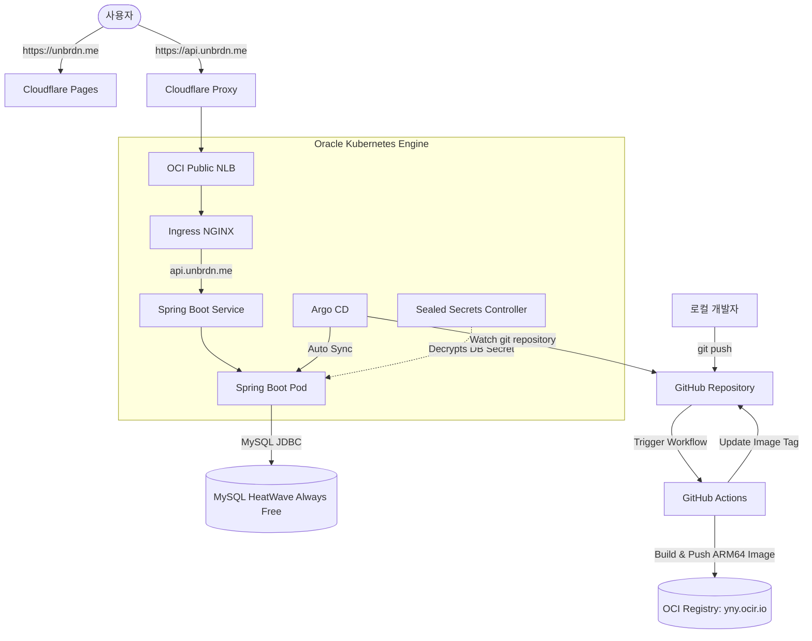
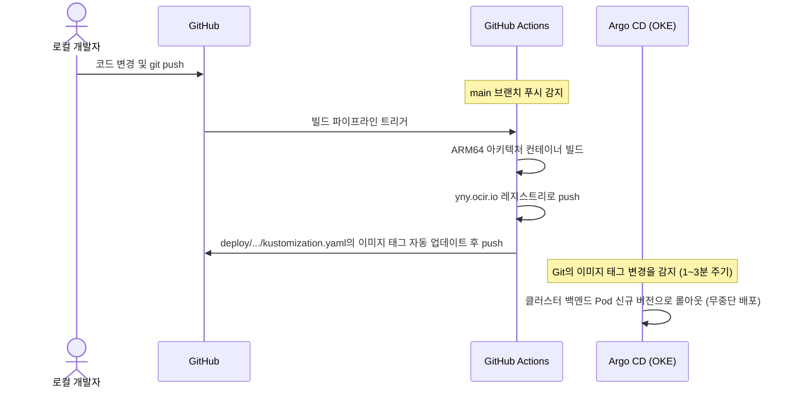

# 📘 self-intro 프로젝트 운영 및 배포 가이드북

이 문서는 **self-intro** 프로젝트의 백엔드 운영 안정화 및 CI/CD & GitOps 배포 환경 고도화 작업 결과를 한눈에 보기 쉽게 정리한 가이드입니다.

---

## 1. 🏗️ 전체 아키텍처 및 배포 흐름도

프로젝트는 프론트엔드와 백엔드가 분리되어 배포되며, 백엔드는 GitOps 방식으로 OKE(Oracle Kubernetes Engine)에 배포됩니다.



---

## 2. 📂 주요 폴더 및 파일 역할 가이드

프로젝트의 `deploy/` 및 설정 파일들의 세부 맵입니다.

| 파일/폴더 경로 | 역할 및 설명 |
| :--- | :--- |
| **`backend/src/main/resources/db/migration/`** | 데이터베이스 마이그레이션(Flyway) 스크립트 보관 폴더 |
| ├─ `V1__init_schema.sql` | 레거시 `study_entry`, `study_entry_skill` 초기 스키마 |
| └─ `V6__replace_study_entry_with_study.sql` | Markdown 기반 `study`와 카테고리·태그·연관 관계 스키마 및 데이터 이관 |
| **`deploy/k8s/base/backend/`** | 백엔드 Kubernetes 배포의 공통 기본 설정 (Deployment, Service) |
| **`deploy/k8s/overlays/prod/backend/`** | 실제 OKE 운영 환경에 배포하기 위한 환경별(Kustomize) 설정 폴더 |
| ├─ `kustomization.yaml` | 빌드 태그, ConfigMap 매핑 및 SealedSecret 연동 정의 |
| ├─ `ingress.yaml` | `api.unbrdn.me` 도메인 라우팅 및 SSL TLS 바인딩 설정 |
| └─ `sealed-db-secret.yaml` | **[중요]** 암호화되어 안전하게 보관되는 DB 접속 패스워드 시크릿 |
| **`deploy/argocd/`** | Argo CD 구축용 경량 설치 매니페스트 및 Application 정의 폴더 |
| ├─ `kustomization.yaml` | 무료 티어 메모리를 아끼기 위해 최대 512MiB 리밋을 건 Argo CD 설치 정의 |
| └─ `application.yaml` | Argo CD가 GitHub 저장소를 감지하고 자동 동기화하도록 지정한 YAML |
| **`.github/workflows/deploy.yml`** | GitHub Actions CI/CD 파이프라인 워크플로우 정의 파일 |

---

## 3. 🔄 일상적인 코드 수정 및 배포 방법 (CI/CD 흐름)

앞으로 소스코드를 수정하고 반영할 때는 로컬에서 이미지를 수동으로 빌드할 필요가 없습니다.



### 💻 실행 커맨드 예시:
1. 백엔드 코드 수정 후:
   ```bash
   git add backend/
   git commit -m "feat: 새로운 API 추가"
   git push origin main
   ```
2. 이후 GitHub Actions가 알아서 작동하여 빌드/태깅하고, Argo CD가 클러스터에 배포를 완료합니다.

---

## 4. 🔒 DB 패스워드 등 민감한 정보 변경 시 가이드 (Sealed Secrets)

GitHub는 공개 저장소이므로 비밀번호를 평문으로 올리면 유출 위험이 있습니다. Sealed Secrets를 사용해 암호화하여 업로드하는 구조입니다.

### 🔑 신규 비밀번호 반영 절차:
1. **임시 raw 시크릿 YAML 만들기** (로컬에만 임시 생성하며 절대 깃에 push하지 마세요):
   ```yaml
   # secret-raw.yaml 예시
   apiVersion: v1
   kind: Secret
   metadata:
     name: backend-db-secret
     namespace: self-intro
   stringData:
     DB_DRIVER: "com.mysql.cj.jdbc.Driver"
     DB_URL: "jdbc:mysql://10.0.30.142:3306/self_intro?serverTimezone=Asia/Seoul&characterEncoding=UTF-8"
     DB_USERNAME: "self_intro_app"
     DB_PASSWORD: "변경할_새로운_비밀번호"
   ```
2. **`kubeseal`로 암호화 파일 생성**:
   ```bash
   kubeseal --controller-name=sealed-secrets-controller \
     --controller-namespace=kube-system \
     --format=yaml < secret-raw.yaml > deploy/k8s/overlays/prod/backend/sealed-db-secret.yaml
   ```
3. **기존 평문 OKE 시크릿 강제 삭제** (컨트롤러가 새 값을 덮어쓸 수 있도록):
   ```bash
   kubectl delete secret backend-db-secret -n self-intro
   ```
4. **Git에 암호화된 파일 push 및 동기화**:
   ```bash
   git add deploy/k8s/overlays/prod/backend/sealed-db-secret.yaml
   git commit -m "deploy: update db password with sealed-secret"
   git push origin main
   ```
   * Argo CD가 이를 감지하여 배포하면, OKE에 있는 Sealed Secrets 컨트롤러가 알아서 복호화하여 `backend-db-secret` 시크릿을 자동으로 만들어 냅니다.

---

## 5. 🛠️ 유용한 문제해결 및 모니터링 명령어

### 1) Argo CD 연동 상태 조회
```bash
kubectl get app -n argocd
```
* 결과가 `Synced` 및 `Healthy`로 출력되는지 확인합니다.

### 2) 백엔드 Pod 헬스 및 실행 로그 모니터링
```bash
# Pod 이름 찾기
kubectl get pods -n self-intro
# 실행 로그 실시간 추적
kubectl logs -f deployment/self-intro-backend -n self-intro --tail=100
```

### 3) Flyway 스키마 상태 확인 (DB 테이블 변경 이력)
* MySQL DB에 접속하여 다음 쿼리를 날려 마이그레이션 이력을 볼 수 있습니다.
```sql
SELECT * FROM self_intro.flyway_schema_history;
```
