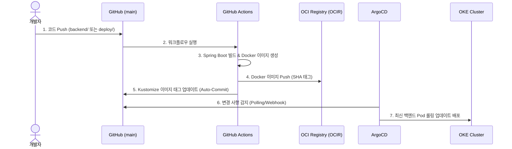

# 💻 YOONSIK SHIN — Portfolio & Study Archive

이 저장소는 개발자 **신윤식(YOONSIK SHIN)**의 개인 포트폴리오 웹 애플리케이션 및 학습 이력(프로젝트, 교육, 자격증)과 코딩테스트 문제 풀이 기록을 통합 관리하는 풀스택 아카이빙 플랫폼입니다.

---

## 🚀 Key Features

- **Interactive Portfolio**: 프로필, 학력 정보, 핵심 기술 역량 및 프로젝트 이력(CS Test Bed, LogDoctor 등) 상세 소개 페이지
- **Study & Career Tracker (CRUD)**: 웹 화면을 통해 프로젝트, 교육 이력, 자격증 등 학습 내역을 실시간으로 등록 및 조회하는 기능 제공
- **Coding Test Practice & Concept Notes**: 알고리즘/자료구조 문제 풀이 이력과 기술 개념을 정리하여 영구 아카이빙

---

## 🛠️ Tech Stack

### Frontend
- **Framework & Language**: `React 19`, `TypeScript`
- **Build Tool**: `Vite`
- **Styling**: `Tailwind CSS`
- **State Management & Data Fetching**: `Zustand`, `TanStack Query (React Query)`

### Backend
- **Framework & Language**: `Java 21`, `Spring Boot 3.3`
- **Database Access**: `Spring Data JPA`, `QueryDSL`
- **Database Migrations**: `Flyway`
- **Database**: `H2` (Local Dev) / `MySQL` (Production)

### Cloud & DevOps (GitOps)
- **Infrastructure**: `OKE (Oracle Kubernetes Engine)`, `MySQL HeatWave Always Free`
- **Registry**: `OCIR (Oracle Cloud Infrastructure Registry)`
- **Continuous Integration (CI)**: `GitHub Actions`
- **Continuous Deployment (CD/GitOps)**: `ArgoCD`
- **Frontend Hosting**: `Cloudflare Pages` (정적 배포)

---

## 📐 System Architecture

이 프로젝트는 자원의 효율성과 배포 안전성을 극대화하기 위해 **프론트엔드 정적 호스팅**과 **백엔드 컨테이너 GitOps** 파이프라인으로 구성되어 있습니다.

```mermaid
flowchart TD
    subgraph Client ["Client (Browser)"]
        User["사용자"]
    end

    subgraph CDN ["Frontend Delivery"]
        CF["Cloudflare Pages"]
    end

    subgraph Cloud ["Oracle Cloud Infrastructure (OCI)"]
        subgraph K8s ["OKE Cluster (Kubernetes)"]
            Ingress["ingress-nginx"]
            Backend["Spring Boot Pods (Java 21)"]
        end
        DB[("MySQL HeatWave DB")]
    end

    User -->|1. React 앱 로드| CF
    User -->|2. API 요청 (api.example.com)| Ingress
    Ingress -->|라우팅| Backend
    Backend -->|데이터 CRUD| DB
```

### 🚢 CI/CD 배포 파이프라인 (GitOps Flow)



---

## 💻 Local Setup

### Prerequisites
- JDK 21
- Node.js 20+

### 1. Backend Run
```bash
cd backend
# 로컬 개발 환경용 H2 인메모리 DB 및 초기 샘플 데이터 시드로 구동
./gradlew bootRun --args='--spring.profiles.active=local'
```
*백엔드 API는 `http://localhost:8080`에서 구동됩니다.*

#### NVIDIA NIM 핵심 역량 AI 활성화

관리자 핵심 역량 작성 화면의 AI 초안 기능은 기본적으로 비활성화되어 있습니다.
루트 `.env`에 아래 값을 설정한 뒤 백엔드를 재시작하세요. API 키는 저장소에 커밋하지 않습니다.
백엔드는 NVIDIA NIM을 두 번 순차 호출하여 `포트폴리오 근거 추출 → 검증된 근거 기반 역량 작성`을 수행합니다.

```env
COMPETENCY_AI_ENABLED=true
NVIDIA_API_KEY=<build.nvidia.com에서 발급한 키>
NVIDIA_MODEL=qwen/qwen3.5-122b-a10b
```

NVIDIA 호스팅 NIM API는 프로토타이핑 용도로 제공되므로, 운영 사용 전 현재 이용 약관과 한도를 확인해야 합니다.

### 2. Frontend Run
```bash
cd frontend
npm install
npm run dev
```
*프론트엔드 개발 서버는 `http://localhost:5173`에서 구동되며, Vite dev proxy가 `/api` 요청을 로컬 백엔드로 위임합니다.*

---

## 📁 Directory Structure

```text
.
├── .github/workflows/     # CI/CD 자동화 배포 정의 (GHA)
├── backend/               # 학습 내용 관리 API 서버 (Spring Boot)
│   └── src/main/resources/db/migration/ # Flyway DB 초기 스키마
├── frontend/              # 포트폴리오 및 학습 등록 React 앱
├── deploy/                # 인프라 배포 설정 파일
│   ├── k8s/               # OKE 환경 쿠버네티스 매니페스트 (Kustomize)
│   ├── argocd/            # ArgoCD 배포 애플리케이션 정의
│   └── oracle-free-tier.md # OCI 배포 구축 메모 문서
├── problems/              # 알고리즘/자료구조 문제 풀이 이력
├── concepts/              # 학습 개념 정리 문서
├── scripts/               # 신규 알고리즘 문제 생성 헬퍼 스크립트
└── templates/             # 알고리즘 문제 템플릿
```
