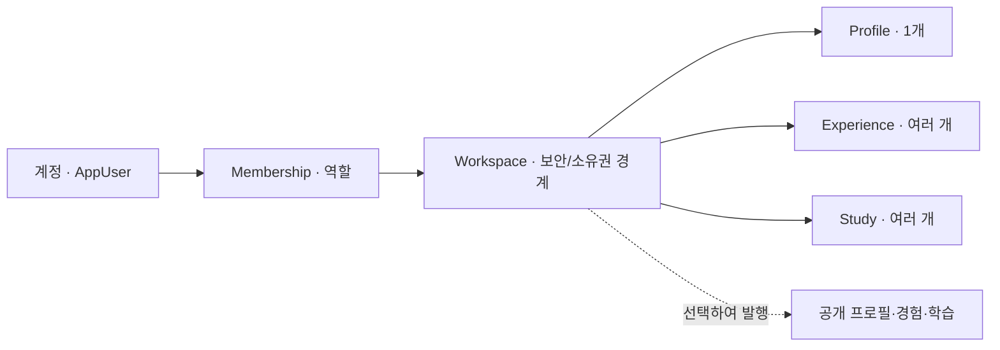

# Self-Intro 제품 기능 지도

- 최종 갱신: 2026-08-12
- 대상 브랜치: `feat/saas-security-foundation`
- 문서 역할: 제품 구조와 구현 상태를 이해하기 위한 **첫 진입점**
- 설계 결정 source of truth: [ADR-001](../adr/ADR-001-saas-security-multitenancy.md), [ADR-002](../adr/ADR-002-registration-and-workspace-onboarding.md), [ADR-003](../adr/ADR-003-public-page-composition-and-domain-taxonomy.md)
- 실제 운영 절차·검증 상태: [SaaS 운영 가이드](../operations/saas-operations-guide.md)
- 현재 작업 트리·준비도 기준: [SaaS 전환 작업 체크포인트](../operations/saas-transition-checkpoint.md)

이 문서는 Self-Intro의 기능을 사용자, 데이터 소유권, 화면, 권한 기준으로 한 번에 찾을 수 있도록
정리한다. 설계 이유는 ADR, 실행 방법은 운영·베타 가이드, 실제 구현 여부는 이 문서의 상태표와 코드·
migration을 함께 확인한다.

## 1. 제품 한 문장

Self-Intro는 개인과 팀이 경력·프로젝트·학습 근거를 Workspace에 축적하고, 공개 프로필과 지원별
이력서로 발행하도록 돕는 경력 자산 관리 SaaS다.

`AppUser`는 사람과 인증을 나타내고, `Workspace`는 프로필·경험·학습 콘텐츠를 소유한다. 사용자는
`Membership`을 통해서만 Workspace를 관리한다.



## 2. 사용자와 권한

| 사용자             | 권한 기준                                 | 할 수 있는 일                         |
| ------------------ | ----------------------------------------- | ------------------------------------- |
| 공개 방문자        | 공개 상태                                 | 발행된 Profile·Experience·Study 조회  |
| 비공개 베타테스터  | 계정 + Workspace Membership               | 초대 가입, 자기 Workspace 생성·관리   |
| Workspace `OWNER`  | 해당 Workspace Membership                 | Workspace 소유·멤버·발행 관리         |
| Workspace `ADMIN`  | 해당 Workspace Membership                 | Workspace 관리                        |
| Workspace `EDITOR` | 해당 Workspace Membership                 | 콘텐츠 편집                           |
| Workspace `VIEWER` | 해당 Workspace Membership                 | 비공개 Profile·Experience·Skill·Study 읽기 전용 |
| 플랫폼 운영자      | `PLATFORM_OWNER` 또는 `PLATFORM_OPERATOR` | 관리 셸의 조건부 메뉴에서 플랫폼 운영 |

Workspace 역할과 플랫폼 역할은 합산하지 않는다. 플랫폼 운영자도 Membership이 없는 다른 Workspace를
관리할 수 없고, Workspace `OWNER`도 플랫폼 역할 없이는 `/ops`에 접근할 수 없다.

## 3. 데이터 소유권 경계

| Account                     | Platform Shared            | Workspace                 | Platform Operations      |
| --------------------------- | -------------------------- | ------------------------- | ------------------------ |
| 로그인 이메일·비밀번호 hash | 공통 기술 정의             | Profile·연락처 공개 설정  | 가입 초대                |
| 내부 닉네임·계정 상태       | 공통 taxonomy              | Experience·Project·Study  | 시스템 아키텍처          |
| MFA·약관·실명 인증          | 향후 기본 템플릿·일반 지식 | 역량·포트폴리오·출력 서식 | 후원·전체 감사·운영 통계 |
| 플랫폼 역할                 | 공통 자료·승인 공고 원본   | Membership·공개 설정·파일 | Support Access           |

계정 탈퇴와 Workspace 삭제는 같은 작업이 아니다. 계정 탈퇴 전 Workspace 소유권 이전 또는 폐쇄를
결정해야 하며, Workspace 삭제 시에만 해당 Workspace 콘텐츠와 파생 데이터의 삭제를 전파한다.

현재 Profile, Experience, Study, Competency, Tag, Portfolio Case Study, PrintTemplate이 직접
`workspace_id`를 갖는다. Skill은 공통 정의를
유지하고 `workspace_skill`에 숙련도·버전·설명·핵심 여부·노출 순서를 저장한다. 대표 프로젝트 배치는
Experience의 Workspace를 상속해 조회·교체한다. Taxonomy node는 플랫폼 공통 정의이고 공개 Study에
노출할 항목과 순서는 Workspace 공개 학습 구성으로 관리한다. Taxonomy는 버전이 있는 domain scheme이며
Workspace가 여러 플랫폼 template 또는 자체 scheme을 구독할 수 있다. 기존 개발자 트리는
`software-engineering` v1으로 보존한다. 학습 자료·지원 데이터와 나머지 AI·벡터
파이프라인은 아직 전환 중이다.

## 4. 화면과 URL 지도

### 제품·공개·관리 경계

| URL                            | 화면 소유자 | 현재 역할                                | 상태    |
| ------------------------------ | ----------- | ---------------------------------------- | ------- |
| `/`                            | 플랫폼      | 제품 소개·가입·로그인 진입               | 구현    |
| `/architecture/demo`           | 플랫폼      | 저장 없는 합성 Workspace 체험            | 구현    |
| `/workspace/{slug}`            | Workspace   | 공개 Profile                             | 구현    |
| `/workspace/{slug}/experience` | Workspace   | 공개 Experience 목록·상세                | 구현    |
| `/workspace/{slug}/study`      | Workspace   | 공개 Study 목록·상세                     | 구현    |
| `/workspace/{slug}/ontology`   | Workspace   | 공통 지식 + Workspace Study 근거         | 구현    |
| `/workspace/{slug}/manage`     | Workspace   | 권한에 따라 달라지는 단일 관리 셸        | 전환 중 |
| `/ops`                         | 플랫폼      | 관리 셸의 운영 메뉴로 이동하는 호환 주소 | 구현    |

기존 `/admin`, `/experience`, `/study`, `/experience-tree`, `/architecture`는 단일 사용자 시절의 호환
경로다. 새 Workspace 관리 기능과 링크는 `/workspace/{slug}/manage`를 사용한다. `/ops`는 운영 메뉴
바로가기 호환 주소로만 사용한다.

### Workspace 공개 네비게이션

- `프로필` → `/workspace/{slug}`
- `경험` → `/workspace/{slug}/experience`
- `학습` → `/workspace/{slug}/study`
- 현재 Workspace의 `OWNER`, `ADMIN`, `EDITOR`에게만 `Workspace 관리` 버튼 표시

slug는 공개 라우팅 식별자이지 권한 증명이 아니다. 이메일·닉네임·`owner` 같은 역할명을 자동으로
포함하지 않으며 접근 권한은 Membership과 발행 상태로 판단한다.
`OWNER` 또는 `ADMIN`이 최근 비밀번호 재확인 후 canonical slug를 바꿀 수 있고 기존 slug는 active
alias로 남는다. 공개 하위 경로는 새 canonical URL로 308 redirect하며, 관리 API는 alias를 해석한 뒤에도
Membership을 다시 확인한다.
bootstrap 계정의 표시 이름과 Workspace 이름도 별도 설정으로 관리한다. 화면의 Workspace 이름이
플랫폼 역할을 뜻하지 않도록 기존 `Platform Owner` Workspace 이름은 `경력 관리 워크스페이스`로
변경했다.

## 5. 기능 영역과 구현 상태

상태 의미:

- **구현**: 현재 Docker Compose에서 주요 흐름 검증 완료
- **전환 중**: 일부 데이터·API·화면만 Workspace 경계를 적용
- **설계**: 결정은 끝났지만 구현 전
- **레거시**: 기존 기능은 동작하지만 SaaS 사용자에게 개방하면 안 됨

| 기능 영역               | 데이터 소유권              | 공개 화면                 | 관리 화면/API                                    | 상태    |
| ----------------------- | -------------------------- | ------------------------- | ------------------------------------------------ | ------- |
| 계정·이메일 로그인      | Account                    | 해당 없음                 | 가입·로그인·이메일 확인                          | 구현    |
| 비공개 베타 초대        | Platform                   | `/signup`                 | 관리 셸의 운영자 전용 메뉴                       | 구현    |
| Vector 정합성 점검      | Platform 파생 데이터       | 해당 없음                 | 운영자 전용 대조·고아/누락 정리                  | 구현    |
| Workspace·Membership    | Workspace                  | 공개 상태에 따라 404      | 생성·초대·수락·거절·역할·소유권 관리             | 구현    |
| Profile                 | Workspace                  | Workspace slug 조회       | slug 기반 관리·Membership 인가                   | 구현    |
| Experience              | Workspace                  | 목록·상세 Workspace 격리  | 관리·연결·대표 배치 API·UI                       | 구현    |
| Study                   | Workspace                  | 목록·상세 Workspace 격리  | canonical 관리 API·UI                            | 구현    |
| Tag                     | Workspace                  | Workspace별 Study tag     | Study에서 Workspace별 생성                       | 구현    |
| Skill                   | 공통 catalog + Workspace   | Workspace overlay만 포함  | catalog 선택·표현·연결 관리 UI                   | 구현    |
| Competency              | Workspace                  | Workspace별 응답          | canonical 관리 API·UI                            | 구현    |
| Taxonomy                | versioned scheme + Workspace 구독 | Workspace별 공개 탐색 | 공개 페이지 학습 구성 + 플랫폼 scheme 원본 UI | 구현    |
| 개발자 온톨로지         | 공통 catalog + Workspace   | Workspace별 Study 근거    | canonical 관리 API·UI                            | 구현    |
| 학습 자료·학습 계획     | catalog + Workspace 상태   | 일부 기존 화면            | canonical 관리 API·UI                            | 구현    |
| 지원 공고·지원별 이력서 | 승인 catalog + Workspace 비공개 원본·지원 | 비공개 | URL·스크린샷 parse-only, 직접 입력·지원·매칭·AI 경계 구현 | 구현 |
| Portfolio Case Study    | Workspace                  | Workspace별 발행 API      | canonical 관리 API·UI                            | 구현    |
| PrintTemplate           | Workspace                  | Workspace별 공개 서식 API | canonical API·Workspace UI                       | 구현    |
| 출력 원본·구성 revision | Workspace                  | 비공개 원본 / 공개 snapshot 분리 | 템플릿별 포함·제외·복원                    | 구현    |
| 공개 revision           | Workspace                  | 발행본 전용 API           | 초안→발행→공개 중지                              | 구현    |
| 객체 저장소             | Workspace key namespace    | 공개/비공개 scope 분리    | private PDF·purge adapter 구현, 파일 검사 미완료 | 전환 중 |
| AI·벡터 검색            | Experience·Study Workspace | 직접 공개 안 함           | 경력·학습·역량 초안 입력 격리                    | 구현    |
| 플랫폼 MFA·세션 보안    | Account/Platform           | 해당 없음                 | 운영자 MFA·재인증                                | 구현    |
| Support Access          | Platform 보안 경계         | 해당 없음                 | 승인·사유·만료·최소 범위·감사                    | 구현    |

## 6. 현재 관리자 화면을 읽는 법

현재 canonical 관리 주소는 `/workspace/{slug}/manage`다. Workspace 멤버는 모두 같은 관리 셸에
진입하고, Membership과 플랫폼 역할에 따라 메뉴와 상단 도구가 달라진다. 기존
`/workspace/{slug}/admin`은 query를 보존해 `/manage`로 이동하는 호환 주소다.
우측 상단 계정 메뉴는 현재 로그인한 닉네임·이메일, 현재 Workspace 역할, 플랫폼 역할을 함께 보여줘
여러 계정과 역할을 테스트할 때 현재 보안 주체를 분명히 확인하게 한다.
같은 브라우저 프로필의 탭은 하나의 `JSESSIONID`를 공유한다. 다른 탭에서 로그인 계정이 바뀌거나
로그아웃되면 모든 탭이 인증 이벤트를 감지해 계정 종속 query cache와 저장 전 관리 미리보기를 지운 뒤
안전한 메인 화면을 다시 연다. 탭별로 서로 다른 계정을 동시에 유지하지 않는다.

### Workspace 메뉴 정보 구조

관리 셸은 저장 위치의 기술 용어인 `DB` 대신 사용자가 수행하는 작업과 공개 효과를 기준으로 메뉴를
구분한다.

- `Workspace 설정`: 기본 설정, 멤버·권한, 현재 Workspace의 공개 페이지 통계
- `내 기록`: 경력·프로젝트, 학습 기록, 기술 스택, 학습 자료, AI 학습 계획. 저장만으로 공개되지 않는다.
  Experience·Competency 원본 API는 레거시 공개 플래그를 새로 켜거나 수정하지 않는다. Study의
  `작성 중/작성 완료`는 문서 편집 상태일 뿐 공개 여부가 아니다.
- `공개 페이지`: 전체 공개본 발행, 프로필 구성, 경험 구성, 학습 구성.
  원본 기록에는 공개 여부를 저장하지 않고 이 영역에서만 노출·순서·강조 방식을 관리한다.
  프로필과 경험은 각각 불변 revision을 가지며 Study는 별도 revision 없이 전체 공개본에 content·taxonomy
  snapshot으로 포함된다.
  `공개본·버전`은 새 버전 발행·공개 중지·발행 이력을 Workspace 기본 설정과 분리한다. 발행 전까지
  방문자가 보는 공개 revision에는 반영되지 않는다.
- `학습 구성`에서 직군별 taxonomy scheme을 하나 이상 구독하고 대표 체계를 지정한 뒤, 구독된 node 중
  공개 탐색에 사용할 카테고리만 고른다. 플랫폼 taxonomy 원본 관리와 Workspace 공개 선택은 별도다.
- `지원·출력`: 지원 현황, 이력서·PDF 템플릿. 공개 메인페이지와 별개의 결과물이다.

사이드바 그룹 제목의 도움말 버튼은 위 범위와 공개 효과를 어두운 툴팁으로 보여준다. 각 목록 화면은
자체 제목과 설명만 유지해 같은 설명을 두 번 출력하지 않는다. 미리보기는 플랫폼 역할이 아니라 현재
Workspace의 `OWNER`, `ADMIN`, `EDITOR` Membership을 기준으로 제공한다. 실제 발행·공개 중지는
`공개 페이지 > 공개본·버전`에서 `OWNER`, `ADMIN`만 수행한다. schema v3 발행은 프로필 구성 revision과
경험 구성 revision을 고정하고, 선택한 학습 기록·탐색 taxonomy를 전체 Workspace snapshot에 함께
복사한다. 포트폴리오 사례는 자체 content revision을 먼저 준비하되, 공개 페이지 포함 여부와 순서는
`경험 구성`에서 결정한다.

### 플랫폼 운영자에게만 표시할 메뉴

- Grafana·ArgoCD·Actions·전체 서비스 상태
- 플랫폼 전체 방문자 통계
- 플랫폼 후원·결제 운영
- 전역 분류 체계와 제품 아키텍처 콘텐츠
- 초대·사용자·보안 감사·Support Access
- 폐쇄 Workspace 삭제 점검·저장소별 dry-run
- MySQL 원본·Oracle Vector namespace read-only 정합성 점검, 재인증 기반 고아 정리, 명시적 외부 전송 기반 누락 복구

모든 플랫폼 기능은 일반 Workspace 메뉴 사이에 섞지 않고 관리 셸 맨 아래의 단일
`플랫폼 운영자 전용` 블록에 둔다. 블록 안에서 사용자·서비스 운영, 공통 데이터 운영, 시스템 정합성으로
구분하되 `PLATFORM_OWNER`, `PLATFORM_OPERATOR`에게만 표시한다. `/ops`는 별도 셸을 제공하지 않고 첫
Workspace의 `manage?tab=INVITATIONS`로 이동한다. Taxonomy 원본 편집과 제품 Architecture처럼 플랫폼
소유인 콘텐츠 메뉴는 일반 계정에 표시하지 않는다. Profile·Experience·Study·Skill·Competency는 canonical
Workspace API 전환을 완료해 일반 Workspace 관리자에게 개방했다. Experience·Study·Competency AI도
slug 기반 canonical endpoint와 Workspace 후보 조회를 사용한다. 기존 `/api/admin/**`는 bootstrap·플랫폼
호환 endpoint로만 남고 Workspace 관리 UI에서는 호출하지 않는다.

## 7. 관리 주체별 기능·콘텐츠 지도

Workspace 관리 UI는 아래 표의 `최종 관리 주체`에 따라 canonical endpoint만 사용한다. 플랫폼/bootstrap
호환용 `/api/admin/**`가 남아 있어도 플랫폼 역할 없이 호출할 수 없고 Workspace 메뉴에서는 참조하지
않는다.

### Workspace가 소유·관리할 콘텐츠

| 기능                       | 최종 관리 주체              | 권한 기준                  | 현재 상태                             |
| -------------------------- | --------------------------- | -------------------------- | ------------------------------------- |
| 프로필 정보                | Workspace                   | `OWNER`, `ADMIN`, `EDITOR` | slug 기반 관리 API 구현               |
| 이력·경력·프로젝트         | Workspace                   | `OWNER`, `ADMIN`, `EDITOR` | canonical 관리 API·UI 구현            |
| 공부 정리·기술 노트        | Workspace                   | `OWNER`, `ADMIN`, `EDITOR` | canonical 관리 API·UI 구현            |
| 개발자 온톨로지            | catalog + Workspace overlay | `OWNER`, `ADMIN`, `EDITOR` | 공통 지식 + Study 연결 격리 구현      |
| 학습 자료                  | Workspace                   | `OWNER`, `ADMIN`, `EDITOR` | catalog 선택 + 상태·메모 UI 구현      |
| AI 학습 계획               | Workspace                   | `OWNER`, `ADMIN`, `EDITOR` | Workspace 후보·계획·AI 경계 구현      |
| 기술 스택                  | Workspace                   | `OWNER`, `ADMIN`, `EDITOR` | 공통 catalog + 표현·연결 구현         |
| 핵심 역량                  | Workspace                   | `OWNER`, `ADMIN`, `EDITOR` | canonical 관리 API·UI 구현            |
| 핵심 프로젝트 노출·순서    | Workspace                   | `OWNER`, `ADMIN`, `EDITOR` | Experience 소유권 상속 + canonical UI |
| 지원 현황                   | Workspace                   | `OWNER`, `ADMIN`, `EDITOR` | 내 지원 + 승인 공통 공고 + 비공개 URL·직접 입력 |
| 공고 공유 심사              | Platform                    | 플랫폼 운영자              | 권한 증빙 검토 + 공통 공개 승인        |
| 지원별 이력서·자기소개서   | Workspace                   | `OWNER`, `ADMIN`, `EDITOR` | 자소서·PDF API 격리, 플랫폼 AI 제한   |
| 포트폴리오 Case Study      | Workspace                   | `OWNER`, `ADMIN`, `EDITOR` | canonical 관리 API·UI 구현            |
| PDF 템플릿·출력 설정       | Workspace                   | `OWNER`, `ADMIN`, `EDITOR` | 소유권·canonical API·UI 구현          |
| Workspace별 분류·카테고리  | Workspace                   | `OWNER`, `ADMIN`, `EDITOR` | scheme 구독 + 공개 학습 구성 구현     |
| 공개 페이지 방문 통계      | Workspace                   | `OWNER`, `ADMIN`           | 별도 집계·canonical API·UI 구현       |
| 공개 Profile·revision·slug | Workspace                   | `OWNER`, `ADMIN`           | 불변 revision·발행·alias UI 구현      |
| Workspace 멤버·역할        | Workspace                   | `OWNER`, `ADMIN`           | 수락형 초대·역할·제거 UI 구현         |
| Workspace 이름·설정        | Workspace                   | `OWNER`, `ADMIN`           | 이름·slug 변경 구현                   |
| 소유권 이전·Workspace 폐쇄 | Workspace                   | `OWNER`                    | 즉시 차단·purge dry-run 기반 구현     |

플랫폼 운영자는 플랫폼 역할만으로 위 콘텐츠를 열람하거나 수정할 수 없다. 자신의 Membership이 있는
Workspace에서는 해당 Workspace 역할 범위로만 관리한다. 다른 사용자 지원이 필요하면 향후
`Support Access` 승인·사유·만료·감사 흐름을 사용한다.

### 플랫폼 운영자만 관리할 기능

| 기능                                     | 허용 역할                             | 데이터 범위           | 현재 상태                        |
| ---------------------------------------- | ------------------------------------- | --------------------- | -------------------------------- |
| 비공개 베타 초대 발급·폐기               | `PLATFORM_OWNER`, `PLATFORM_OPERATOR` | 플랫폼 전체           | 구현                             |
| Vector namespace 정합성·고아/누락 정리   | `PLATFORM_OWNER`, `PLATFORM_OPERATOR` | 원본·파생 데이터 건수 | 구현, 재인증·외부 전송 확인 필요 |
| 플랫폼 사용자·Workspace 운영 현황        | `PLATFORM_OWNER`, `PLATFORM_OPERATOR` | 상태별 집계값만       | 구현, 식별정보 비노출            |
| 보안 감사·이상 접속                      | `PLATFORM_OWNER`, `PLATFORM_OPERATOR` | 보안 이벤트           | 일부 구현                        |
| Support Access 승인·감사                 | 승인된 운영 역할                      | 승인된 대상·기간만    | 구현·Compose UAT 완료            |
| 플랫폼 전체 방문자 통계                  | `PLATFORM_OWNER`, `PLATFORM_OPERATOR` | 플랫폼 집계           | Workspace 통계와 분리 유지       |
| 후원·결제 운영                           | `PLATFORM_OWNER`, `PLATFORM_OPERATOR` | 플랫폼 거래           | 기존 기능                        |
| Grafana·Prometheus·Loki                  | `PLATFORM_OWNER`, `PLATFORM_OPERATOR` | 플랫폼 인프라         | 외부 도구 링크                   |
| ArgoCD·GitHub Actions                    | `PLATFORM_OWNER`, `PLATFORM_OPERATOR` | 배포·CI/CD            | 외부 도구 링크                   |
| 외부 서비스 상태                         | `PLATFORM_OWNER`, `PLATFORM_OPERATOR` | 플랫폼 의존성         | 구현                             |
| AI provider·모델·비용·사용량 정책        | `PLATFORM_OWNER`, `PLATFORM_OPERATOR` | 플랫폼 전체           | 일부 설정/후속 구현              |
| 전역 분류 템플릿                         | `PLATFORM_OWNER`, `PLATFORM_OPERATOR` | 신규 Workspace 기본값 | Workspace Taxonomy와 분리 필요   |
| Self-Intro 제품 쇼케이스·시스템 아키텍처 | `PLATFORM_OWNER`, `PLATFORM_OPERATOR` | 플랫폼 제품 콘텐츠    | 현재 전역 관리 기능              |
| 운영 Secret·배포 설정                    | 제한된 운영자                         | 플랫폼 인프라         | UI 밖 Secret/GitOps 관리         |

### 계정 본인만 관리할 정보

| 기능                        | 관리 주체                    | Workspace와의 관계               | 현재 상태    |
| --------------------------- | ---------------------------- | -------------------------------- | ------------ |
| 로그인 이메일·비밀번호      | Account 본인                 | 비밀번호 변경 구현, 이메일 변경·비밀번호 분실 재설정 미구현 | 일부 구현    |
| 닉네임                      | Account 본인                 | 멤버 표시용, 공개 Profile과 독립 | 구현         |
| MFA·세션·전체 기기 로그아웃 | Account 본인                 | 전체 기기 로그아웃 구현, 플랫폼 운영자는 MFA 필수 | 일부 구현    |
| 실명 인증                   | Account 본인 + 인증 provider | 공개 Profile로 자동 복사 금지    | 경계만 설계  |
| 약관·개인정보 동의          | Account 본인                 | Workspace와 독립                 | 구현         |
| 계정 탈퇴                   | Account 본인                 | 활성 Workspace 소유권·플랫폼 역할 정리 선행 | 구현         |

### Workspace 역할별 최종 권한

| 작업                  |             `OWNER`             |        `ADMIN`        |       `EDITOR`        |       `VIEWER`        |
| --------------------- | :-----------------------------: | :-------------------: | :-------------------: | :-------------------: |
| 비공개 콘텐츠 조회    |                O                |           O           |           O           |           O           |
| 콘텐츠 생성·수정·삭제 |                O                |           O           |           O           |           X           |
| 공개본 검토·발행      |                O                |           O           |           X           |           X           |
| 멤버 초대             |                O                |           O           |           X           |           X           |
| 역할 변경             |                O                |        제한적         |           X           |           X           |
| Workspace 일반 설정   |                O                |           O           |           X           |           X           |
| 소유권 이전           |                O                |           X           |           X           |           X           |
| Workspace 자발적 탈퇴 |                X                |           O           |           O           |           O           |
| Workspace 폐쇄        | O(purge worker는 flag로 비활성) |           X           |           X           |           X           |
| 플랫폼 운영 기능      |      별도 플랫폼 역할 필요      | 별도 플랫폼 역할 필요 | 별도 플랫폼 역할 필요 | 별도 플랫폼 역할 필요 |

초기에는 `EDITOR`가 공개본을 직접 발행하지 않고 초안 편집까지만 수행하게 한다. 발행과 개인정보 공개
범위 변경은 `OWNER` 또는 `ADMIN`이 검토한다.

여기서 플랫폼 운영자의 `시스템 아키텍처`는 Self-Intro SaaS 자체의 구조와 데모를 뜻한다. 각 사용자가
자신의 프로젝트에서 설계한 아키텍처는 Workspace의 `이력·경력·프로젝트` 또는 `포트폴리오 Case Study`에
포함한다.

### 현재 화면의 임시 노출 정책

- 모든 `OWNER`, `ADMIN`, `EDITOR`는 동일한 `/workspace/{slug}/manage` 셸에 진입한다.
- 플랫폼 운영 도구는 플랫폼 역할이 있는 계정에만 표시한다.
- Profile·Experience·Study·Skill·Competency는 Workspace 역할에 개방하고, 소유권·인가가 끝나지 않은
  나머지 기존 콘텐츠 메뉴는 플랫폼 운영자에게만 임시 표시한다.
- 이 임시 제한은 API 이관이 끝나는 메뉴부터 Workspace 역할 기준으로 제거한다.
- URL query로 숨긴 탭을 직접 요청해도 현재 계정의 허용 탭 목록에 없으면 열지 않는다.

## 8. 핵심 사용자 흐름

### 공개 방문자

```text
공유받은 /workspace/{slug}
  → Profile 확인
  → Experience 상세
  → 관련 Study 근거 확인
```

### 비공개 베타테스터

```text
개인 초대 수신
  → 가입·이메일 확인
  → 로그인
  → 비공개 Workspace 생성
  → 콘텐츠 작성
  → Profile·Experience·Study 작성
  → OWNER 또는 ADMIN이 공개 snapshot 발행
```

### Workspace 관리자

```text
로그인
  → Membership이 있는 Workspace 진입
  → /workspace/{slug}/manage
  → Profile·Experience·Study·Skill·Competency 관리
```

### 플랫폼 운영자

```text
비밀번호 + MFA 로그인
  → /workspace/{slug}/manage?tab=INVITATIONS
  → 재인증
  → 초대 발급·폐기·현황 확인
```

## 9. 보안과 개인정보 불변 조건

1. 모든 Workspace 데이터 요청은 대상 `workspace_id`를 포함한다.
2. 인증·Membership·역할·데이터 소유권을 서버에서 매 요청 검증한다.
3. 다른 Workspace 데이터는 존재 여부를 감추기 위해 404로 응답한다.
4. 공개 API는 명시적으로 발행된 데이터만 반환한다.
5. 이메일·전화번호·실명·비공개 파일은 기본 공개하지 않는다.
6. ID·slug를 추측하기 어렵다는 이유로 권한 검증을 생략하지 않는다.
7. 캐시·파일·이벤트·AI·벡터에도 Workspace 경계를 전파한다.
8. 플랫폼 운영자의 개인정보 접근도 별도 승인과 감사를 요구한다.

상세 기준은 [ADR-001](../adr/ADR-001-saas-security-multitenancy.md)을 따른다.

## 10. 현재 인프라와 이식성

현재 운영 배포 adapter는 OCI다.

- OKE, OCIR, MySQL HeatWave, Oracle ATP/26ai, OCI Object Storage
- Cloudflare, GitHub Actions, ArgoCD, Kustomize

도메인 모델은 OCI에 종속하지 않는다. 객체 저장소와 벡터 검색은 port/adapter 경계 뒤에 두며,
Kubernetes 표준 배포 계약을 유지해 AWS·Azure adapter로 교체할 수 있게 한다. 실제 실행과 배포 순서는
[SaaS 운영 가이드](../operations/saas-operations-guide.md)를 따른다.

## 11. 출시를 막는 핵심 미완료 사항

- 지원 공고의 자기소개서 문항·AI 초안은 V205, 어필 분석·Gap 문서는 V206, PDF AI 초안과 최종
  제출 PDF는 Workspace 지원 건·PrintTemplate·비공개 object scope로 전환 완료. 공용 JobPosting
  벡터와 Workspace 기술 기반 매칭 결과도 분리 완료했으며 실제
  벡터 추천 endpoint와 결과 snapshot 삭제 전파는 아직 없음
- 운영 private object bucket 프로비저닝·기존 PDF 이관, 파일 검사, 삭제 전파 rehearsal
- Competency 벡터를 다시 활성화하려면 별도 Workspace vector schema·cache 검증 필요
- 모든 MFA 수단과 복구 코드를 함께 잃은 계정의 운영 신원 확인 절차, 운영 Secret과 rate limit
- Support Access의 사유·범위·소유자 승인·15~60분 만료·최소 진단·감사 흐름과 Compose V227 적용,
  MFA를 사용하는 SUPPORT 계정과 Workspace OWNER 두 계정 UAT 및 감사 이벤트 확인까지 완료했다. 운영
  provider 반영 전까지 기능은 기본 비활성으로 유지한다.
- 폐쇄 Workspace의 provider-neutral purge job·저장소 checkpoint·MySQL inventory dry-run과
  Worker-only checkpoint orchestration을 구현. 완료 건 skip, 실패 지점 재개, stale lease 재claim,
  MySQL 최종 실행을 보장한다. 로컬 backup clone 복구와 5개 checkpoint 전체 purge rehearsal은
  통과했고 production release gate도 추가했다. maintenance reconciliation과 API/Worker runtime role
  격리도 로컬에서 검증했다. 전체·provider flag는 모두 false이며 운영 backup 보존·OCI provider 복구·
  Service 비노출 격리 Worker reconciliation rehearsal은 미완료
- 계정 탈퇴 구현과 폐기 가능한 일반 Account의 Compose UAT를 완료했다. 로그인과 명시적 재인증을
  분리하고 탈퇴·전체 세션 만료·재로그인 차단·DB 익명화·감사 이벤트를 자동 검증한다. 남은 차단
  조건은 법정·계약상 보존 기간과 운영 복구 정책 확정이다.
- 비밀번호 재설정·MFA 복구를 추가할 때 생기는 단기 인증정보의 보존기간·자동 삭제 계약
- 계정 설정에서 닉네임 변경, 가입과 동일한 10~32자 비밀번호 정책을 적용한 현재 비밀번호 기반 변경,
  전체 기기 로그아웃을 구현했다. 비밀번호 변경 성공 시 현재 세션을 포함한 모든 Redis 세션을 폐기하며
  이름·비밀번호·세션 폐기 작업은 원문을 남기지 않는 보안 감사 이벤트로 기록한다. 이메일 변경과
  비밀번호 분실 재설정은 확인 메일·단기 토큰·회수 정책이 필요해 별도 운영 차단 항목으로 남는다.

이 항목을 끝내기 전에는 일반 베타테스터에게 현재 관리자 기능 전체를 개방하거나 운영 배포하지 않는다.

## 12. 목적별 다음 문서

| 알고 싶은 내용                         | 읽을 문서                                                          |
| -------------------------------------- | ------------------------------------------------------------------ |
| 왜 Workspace 중심으로 설계했는가       | [ADR-001](../adr/ADR-001-saas-security-multitenancy.md)            |
| 가입 정보·이름·slug를 왜 분리했는가    | [ADR-002](../adr/ADR-002-registration-and-workspace-onboarding.md) |
| 로컬 실행·MFA·초대·배포·장애 대응      | [SaaS 운영 가이드](../operations/saas-operations-guide.md)         |
| 초대받은 사용자가 무엇을 해야 하는가   | [비공개 베타테스터 가이드](../beta/private-beta-tester-guide.md)   |
| 아키텍처 페이지와 경력 프로젝트의 차이 | [제품 쇼케이스 경계](../self-intro-product-showcase.md)            |
| 멀티테넌트 도입 전 조사 근거           | [멀티테넌트 조사](../multi-tenant-architecture-research.md)        |

## 13. 문서 갱신 규칙

- 제품·소유권·권한 결정 변경: ADR을 먼저 갱신한다.
- 구현 상태 변경: 이 기능 지도와 운영 가이드를 함께 갱신한다.
- 가입·사용자 흐름 변경: 베타테스터 가이드를 함께 갱신한다.
- migration 추가: 운영 가이드의 migration·검증 결과를 갱신한다.
- 문서와 코드가 다르면 출시를 멈추고 차이를 `전환 중` 또는 `미구현`으로 명시한다.
