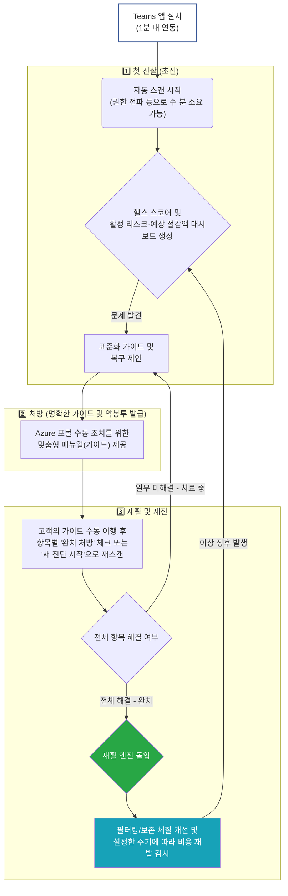

# 🏥 LogDoctor: 당신의 Azure 로그 요금 다이어트 전문의

**LogDoctor**는 Microsoft Azure 환경을 사용하는 팀을 위해 탄생한 **로그 통신 누수 점검 및 비용 최적화 솔루션**입니다.

매달 날아오는 Azure Log Analytics(LAW) 요금 명세서를 보며 "대체 이 로그들은 어디서 오길래 이렇게 비쌀까?", 혹은 장애가 났는데 "왜 정작 이 서버의 로그는 안 쌓여 있지?"라는 고민을 해보신 적 있나요?

LogDoctor는 복잡한 인프라 관리 지식 없이도, 가장 안전하고 빠르게 여러분의 클라우드 건강 상태를 체크하고 불필요한 비용을 깎아내는 **Microsoft Teams 전용 앱**입니다.

---

## 🎯 왜 LogDoctor가 필요한가요

클라우드 시대로 넘어오며 시스템은 복잡해졌고, 관리되지 않는 로그 데이터는 곧 **'숨만 쉬어도 나가는 돈(비용 비만)'** 혹은 **'필요할 때 쓸 수 없는 죽은 데이터(파이프라인 누수)'**가 됩니다.

1.  **눈 먼 돈 절감 (Cost Optimization):** 개발용 콘솔 버그 메시지가 운영 환경에서 하루 수천만 건씩 쌓이며 요금을 폭발시키는 '로그 노이즈'를 찾아냅니다.
2.  **사각지대 해소 (Visibility):** VM은 돌아가는데 에이전트가 단절되어 심야 시간에 에러 로그가 수집되지 않고 있던 위기 상황을 사전에 색출합니다.
3.  **최고의 도입 스피드 (Zero Friction):** 복잡하고 두꺼운 매뉴얼 없이, 우리 팀이 매일 쓰는 **Microsoft Teams** 채팅창 안에서 이 모든 검진과 처방이 원클릭으로 이루어집니다.

---

## 👥 어떤 기업이 LogDoctor를 도입해야 할까요? (Target Audience)

데이터독(Datadog), 스플렁크(Splunk) 같은 비싼 상용 모니터링 툴을 기업 전체에 전면 도입하기엔 **라이선스 비용이 너무나 부담스럽거나**, 기존 Azure 기본 기능만 쓰다 보니 **관리되지 않은 사각지대**가 넘쳐나기 시작한 조직에게 완벽한 대안입니다.

- **🌟 찐 타겟층 1: Microsoft Azure 생태계에 "올인(All-in)"한 중견 기업 (Native Users)**
  - **특징:** 외부 툴의 살인적인 라이선스 비용 대신, "돈 안 드는 Azure 순정 기능(Log Analytics, App Insights)만 기본으로 쓰자"라고 결정한 기업들입니다.
  - **Pain Point:** 순정 환경의 모니터링 편의성이 떨어지다 보니, 개발자들이 여기저기서 디버그 로그를 마구 던져대고 결국은 어마어마한 Azure 과금 폭탄을 맞고 있습니다.
  - **Our Solution:** 비싼 비용을 들이는 대신, LogDoctor가 Teams에서 1분 만에 들어가 불필요한 LAW 요금(비만)만 싹 깎아내고 누수 지점만 정확히 짚어드립니다.
- **🌟 찐 타겟층 2: 멀티 클라우드로 파편화된 일반/전통 대기업 (제조, 금융, 유통)**
  - **특징:** 부서마다 인프라 통제가 안 되어 방치된 레거시 시스템이나 신규 TF팀이 임의로 띄운 Azure VM들이 수두룩한 거대한 조직입니다.
  - **Pain Point:** 데이터독을 전사 규모로 다 깔자니 비용 결재가 나지 않고, 관리되지 않은 서버들이 로그를 제대로 쏘고 있는지(사각지대 단절) 확인할 길이 없습니다.
  - **Our Solution:** 데이터독 라이선스가 없는 사각지대 서버들을 LogDoctor가 전부 끌어안습니다. Read-Only 권한만 주시면 숨어있는 Azure VM들의 통신 단절을 싹 찾아내 최소한의 보안망을 구축해 드립니다.
- **🌟 찐 타겟층 3: IT 전환을 막 시작해 "모니터링 체계" 자체가 없는 고속 성장 기업 (SMB)**
  - **특징:** 개발은 하고 있지만, 에러가 나도 어디서 난지 모르고 모니터링 세팅 같은 걸 할 줄 모르는 인력 부족 조직입니다.
  - **Pain Point:** 어떻게 로그를 구성해야 요금이 싸고 효율적인지(OpenTelemetry 표준 등) 전혀 알지 못합니다.
  - **Our Solution:** 복잡한 공부 없이 LogDoctor 챗봇이 시키는 가이드(약봉투)대로만 따라오면, 대기업 수준의 4대 엔진(탐지·예방·필터·보존) 12종 진단 체계와 최저가 로그 환경이 순식간에 자동으로 세팅됩니다.

---

## ️ LogDoctor 고객 여정 한눈에 보기

고객이 겪게 될 "진단부터 비용 다이어트 유지까지"의 흐름입니다.

---

## ⚙️ 투명한 역할 분담: 자동화(Auto) vs 사용자 제어(Manual)

고객은 언제 개입해야 할까요? LogDoctor는 **'감시와 탐지는 100% 자동'**으로, **'수술과 변경은 100% 사용자 승인'** 하에 통제되도록 명확히 설계되었습니다.

### 🤖 LogDoctor가 백그라운드에서 '알아서' 하는 일 (Automated)

- **즉시 첫 진단 (초진):** 앱 연동 직후 전체 Azure 인프라를 자동으로 스캔하여 비용 누수 포인트를 찾아냅니다. (Entra ID 권한 전파 대기 등으로 완료까지 수 분이 걸릴 수 있습니다.)
- **정기 딥 스캔 (설정 시 상시 감시):** 관리자가 설정한 주기(매일/매주/매월 또는 직접 지정한 cron)에 따라, 우리도 모르게 발생한 디버그 로그 폭탄이나 새롭게 추가된 미연결 서버를 백그라운드에서 추적합니다. *(대시보드에서 별도로 켜야 활성화됩니다.)*
- **연결 이상 및 진단 완료 알림 (Alert):** 에이전트 연결이 15분 이상 끊기거나 새 진단이 끝나면 Teams 채팅 봇이 먼저 알려드립니다.
- **개인정보(PII) 자동 마스킹:** 로그 속 이메일·전화번호·주민등록번호·자격증명 패턴은 Azure Log Analytics 조회 단계에서 즉시 마스킹되며, LogDoctor 서버에는 마스킹된 패턴 유형과 건수만 전달됩니다. 원문 값은 저장·전송되지 않습니다.
- **LLM 기반 맞춤형 처방 생성:** 노이즈 로그 정리, 페이로드 최적화 등 일부 항목은 Azure OpenAI가 상황에 맞는 처방 문구를 자동으로 작성합니다.

### 👤 사용자가 Teams 환경에서 '직접 처리' 하는 일 (User Action required)

- **처방전 확인 및 수동 조치:** 봇이 찾아온 알림과 제공된 상세 가이드를 바탕으로, 보안 구역인 Azure 포털에 직접 들어가 안전하게 인프라를 수정합니다. (현재 버전은 시스템이 고객 인프라를 마음대로 건드리지 않습니다.)
- **정기 스캔 주기 설정:** 대시보드에서 원하는 주기(매일/매주/매월 또는 직접 cron 입력)로 정기 스캔을 켤 수 있습니다.
- **완치 처방 체크 / 재진단:** 조치를 완료한 후 처리된 항목을 '완치 처방'으로 표시하거나, '새 진단 시작'으로 다시 스캔해 문제가 해결됐는지 확인합니다.

---

## 🚀 LogDoctor의 3단계 진료 프로그램

LogDoctor는 실제 병원의 진료 프로토콜에 착안하여, 초진부터 재진, 그리고 영구적인 재활까지 가장 매끄러운 경험을 제공합니다.

### 🩺 Step 1. 진찰 (초진: 자동 검진 및 상태 판독)

- **초진 (Auto-Scan):** 앱을 연동하면 진단 기록이 없을 경우 LogDoctor가 곧바로 현재 Azure 인프라를 무마취로 스캔하여 로그 발생 패턴과 비용 누수 지점을 파악합니다. (Entra ID 권한 전파 대기 등으로 완료까지 수 분이 걸릴 수 있습니다.)
- **차트 생성:** 스캔 결과를 바탕으로 **'헬스 스코어(로그 건강 점수)'**, **활성 리스크**, **예상 비용 절감액**을 Teams 대시보드에 즉시 시각화하여 충격(Wow Moment)을 선사합니다.

### 💊 Step 2. 처방 (원인 분석 및 맞춤형 가이드 발급)

- **복약 지도 및 정형화 처방:** 단순한 알림을 넘어, "현재 연결이 단절된 VM 리스트와 Azure 포털에서 다시 연결하는 방법", "이 로그는 이런 OpenTelemetry 스키마로 변경하세요"라는 명확한 약봉투(가이드)를 전송합니다. 일부 처방은 Azure OpenAI가 상황에 맞춰 자동으로 문구를 작성합니다.
- **철저한 Read-Only 및 안전성:** 쓰기(Write) 권한을 앱에 주실 필요 없이, 세분화된 읽기 전용 권한(18개)만으로 진단합니다. 고객님이 직접 가이드대로 수동 조치하신 뒤, 처리한 항목을 '완치 처방'으로 표시하거나 재스캔을 돌려 확인하시면 됩니다.

### 🕴️‍♂️ Step 3. 재활 및 재진 (4대 엔진 기반 영구 최적화 유지)

- **재방문 인터페이스:** 가이드에 따라 조치한 뒤, 처리된 항목을 '완치 처방'으로 체크하거나 '새 진단 시작'으로 다시 스캔해 현재 상태를 확인합니다.
- **완치 vs 치료 중 (분기점):** 탐지된 항목이 모두 해결되면 **완치**로 표시되며, 일부라도 남아있으면 **치료 중** 상태로 추가 처방 가이드가 유지됩니다.
- **4대 엔진 가동:** LogDoctor의 코어 4대 엔진(탐지·예방·필터·보존)이 상시 동작하며, 완치된 영역부터 효율을 끌어올려 영구적인 비용 다이어트를 달성합니다.
- **면역력(모니터링) 구축:** 설정한 주기(매일/매주/매월 등)에 따라 인프라 건강을 재확인하여 재발 경고를 제공합니다.

---

## 🛠️ 설치와 운영을 돕는 부가 기능

- **간편 설치 마법사:** 연동 확인 → 배포 방식 선택 → 구독 선택 → 배포 → 완료까지 이어지는 단계별 셋업 가이드를 제공합니다.
- **배포 위임(Delegation):** 배포 권한이 없는 담당자도 Teams 메시지로 다른 관리자에게 배포를 요청·위임할 수 있습니다.
- **권한 문제 해결 가이드:** Azure 배포에 필요한 권한(IAM/Owner 등)이 부족할 때, 무엇을 어떻게 조치해야 하는지 안내합니다.
- **다중 구독·에이전트 관리 콘솔:** 여러 Azure 구독에 설치된 에이전트를 한 곳에서 확인·업데이트·제거할 수 있습니다.
- **알림 채널 설정:** 진단 알림을 받을 Teams 팀/채널을 원하는 대로 지정할 수 있습니다.
- **인앱 피드백:** 앱을 쓰다가 불편한 점을 발견하면 화면 안에서 바로 운영팀에 피드백을 남길 수 있습니다.

---

## 🔮 추후 로드맵 (OBO 원클릭 복구 및 GitHub AI 수술)

LogDoctor의 진화는 진단과 가이드를 발급(안내)하는 데 그치지 않습니다. 추후 업데이트될 프리미엄 빌드에서는 고객 승인 하에 **우리가 직접 인프라와 코드를 고쳐주는(수술) 100% 자동화 경험**을 추가 제공할 예정입니다.

- **원클릭 인프라 응급 복구 (OBO 위임):** 가장 안전한 Microsoft의 SSO OBO(On-Behalf-Of) 기술을 이용해, 고객이 `[즉시 복구]` 버튼을 누르는 순간 1회성 권한만 위임받아 알아서 끊어진 파이프라인(혈관)을 수술하고 권한을 소각시킵니다.
- **AI 로봇 분석/수술 (GitHub 연동):** Azure LAW 모니터링 데이터와 GitHub API를 엮어 문제를 일으키는 소스코드를 매핑하고, AI가 짠 **수정본(Pull Request)**을 발송하여 Merge 클릭 한 번에 앱 마이그레이션이 끝납니다.

---

## 🔒 우리 회사의 보안을 믿고 맡겨도 되나요? (절대 우려 금지!)

LogDoctor의 1원칙은 **"고객 환경의 안정성과 데이터를 절대로 침해하지 않는다"** 입니다. 우리 앱은 업계 최고 수준의 '최소 권한 부여(Least Privilege)' 사상으로 설계되었습니다.

1.  **눈팅만 합니다 (읽기 전용 에이전트):** LogDoctor의 상시 에이전트는 쓰기(Write)·삭제(Delete) 권한 없이, 진단에 필요한 **읽기 전용 권한(18개)**과 AI 처방 생성을 위한 별도 OpenAI 권한만 요구합니다. 실수로 서버를 끄거나 DB를 지울 확률은 **0%**입니다.
2.  **개인정보 원문은 밖으로 나가지 않습니다:** 로그 속 개인정보(이메일, 전화번호, 주민등록번호, 자격증명 등)는 Azure Log Analytics 조회 단계에서 즉시 마스킹되며, LogDoctor 서버나 화면에는 마스킹된 패턴 유형·건수만 전달됩니다. 다만 '운영 환경 디버그 로그' 진단(PRV-001)은 App Service 설정값을 읽어와 로그 레벨 설정 여부만 확인하는 과정에서, 앱 설정 전체(환경 변수 등 포함 가능)를 일시적으로 조회할 수 있습니다.
3.  **필요한 순간만, 짧게 위임받는 인증:** 신규 연동·해지 시에만 고객님의 인증(SSO 토큰)을 잠깐 위임(OBO)받아 LogDoctor 자체 스캔 인프라를 설치·제거하며, 작업이 끝나면 즉시 위임을 반납합니다. 진단된 문제를 자동으로 고쳐주는 '원클릭 복구'는 아직 제공하지 않으며(위 로드맵 참고), 현재 버전은 고객님이 가이드를 보고 직접 Azure 포털에서 조치하셔야 합니다.

---

**LogDoctor와 함께, 지금 바로 당신의 Azure 환경 건강검진을 시작해 보세요! 🩺**
